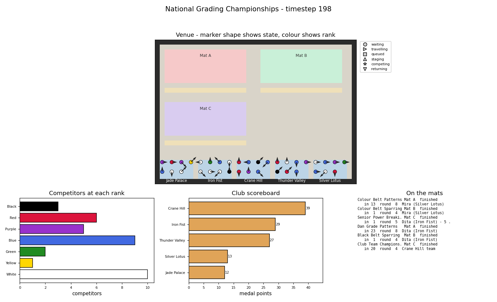

# Py Kwon Do - Martial Arts Simulation

Milestone Project 5, Fundamentals of Programming.

Student Name : ajwang-kajwang
Student ID   : 6789998212

A simulation of a martial arts competition: competitors from several
clubs wait in their club area, are called up to events they are
eligible for, walk to the mat, compete, and go home with medal points
for themselves and their club.  The whole thing is driven by scenario
files, so the same code runs a ten-person club night or a 36-person
national grading with seven belt colours and three mats.



## Quick start

```bash
python3 compSim.py                                        # asks a few questions
python3 compSim.py --list-scenarios                       # what is available
python3 compSim.py --scenario scenarios/regional_titles.json
```

Dependencies: Python 3.8+, `numpy` and `matplotlib`.

```bash
sudo apt install python3-numpy python3-matplotlib      # Debian/Ubuntu
python3 -m pip install numpy matplotlib                # anywhere else
```

## Files

| File | What it holds |
|---|---|
| `compSim.py` | **The program you run.** Command line parsing, the run itself, the parameter sweep, saving output. |
| `pykwondo.py` | **The world.** `RankSystem`, `Club`, `Competitor`, `Area` and `Venue`. |
| `events.py` | `Event` base class and the four event types (`PatternEvent`, `SparringEvent`, `TeamPatternEvent`, `BreakingEvent`). |
| `characters.py` | The unit's given `Student` class, with the two fixes made in Practical Test 3. `Competitor` subclasses it. |
| `competition.py` | `Competition` - the schedule, the timestep loop and the results tables. |
| `visualise.py` | `SimView` - the single-window live dashboard. |
| `reporting.py` | Entry statistics, the text report, the results CSV and the summary plots. |
| `scenario.py` | Loading/validating scenario files, CSV rosters, generated rosters and the validated prompts. |
| `scenarios/*.json` | The three showcase scenarios. |
| `scenarios/national_grading_roster.csv` | A competitor roster read from file. |
| `results/` | Reports, CSVs and plots produced by the showcase runs. |
| `docs/UML.md` | UML class diagram and the design decisions made before coding. |
| `docs/TRACEABILITY.md` | Traceability matrix - feature, code, test, result, date. |
| `tests/` | 51 tests; `python3 tests/run_tests.py` runs them all. |
| `run_showcase.sh` | Runs the three showcase scenarios plus the parameter sweep. |

## Running it

### The three showcase scenarios

No source file changes between these - only the scenario file and the
switches differ.

```bash
./run_showcase.sh                 # all three, plus the sweep, into results/

# or one at a time
python3 compSim.py --scenario scenarios/club_night.json
python3 compSim.py --scenario scenarios/regional_titles.json
python3 compSim.py --scenario scenarios/national_grading.json
```

| Scenario | What it shows |
|---|---|
| `club_night.json` | 10 competitors, 2 clubs, **one** mat, 2 event types. Events run one after the other because there is only one mat. |
| `regional_titles.json` | 28 generated competitors, 4 clubs, **two** mats, all **four** event types. Junior and senior events run in parallel because their rank bands do not overlap. |
| `national_grading.json` | 36 competitors **read from a CSV file**, 5 clubs, **seven** belts (a Purple belt is added in the scenario file alone), three mats, six events. |

### Useful switches

```bash
python3 compSim.py --scenario scenarios/regional_titles.json --seed 5
python3 compSim.py --scenario scenarios/regional_titles.json --no-animation
python3 compSim.py --scenario scenarios/club_night.json --speed 0.1 --quiet
python3 compSim.py --scenario scenarios/regional_titles.json \
        --sweep competitors.count=12,24,36 --repeats 3 --seed 1
python3 compSim.py --help
```

`--seed` makes a run exactly reproducible, `--no-animation` runs
headless for batch work, and `--sweep KEY=V1,V2,...` runs the same
scenario once per value and tabulates what changed.

### Output

Every run writes into `results/` (change with `--results-dir`, turn off
with `--no-save`):

* `<scenario>_report.txt` - entry statistics, every event's placings, the individual and club standings, and a timestamped commentary
* `<scenario>_results.csv` - one row per competitor result, for further analysis
* `<scenario>_summary.png` - competitors per rank, per club, club points and the shape of the day
* `<scenario>_final.png` - the venue at the final timestep

### Tests

```bash
python3 tests/run_tests.py            # 51 tests, no pytest needed
python3 tests/run_tests.py test_events  # one module
```

## Writing your own scenario

A scenario is a JSON object.  Only `name`, `clubs` and `events` are
required; everything else has a default.

```json
{
  "name": "My Competition",
  "seed": 7,
  "steps": 300,
  "max_parallel": 2,
  "clubs": ["Jade Palace", "Iron Fist"],
  "ranks": [{"name": "White", "colour": "white", "skill": 35}],
  "competitors": {"count": 20, "age_range": [10, 50],
                  "rank_weights": {"White": 3, "Black": 1},
                  "skill_chance": {"pattern": 1.0, "sparring": 0.7}},
  "events": [{"type": "pattern", "name": "Patterns", "mat": "Mat A",
              "max_rank": "Green", "max_age": 17}]
}
```

* `competitors` is either `{"count": N, ...}` for a generated field or
  `{"file": "roster.csv"}` to read one (columns: id, name, age, club,
  rank, skills, form - skills separated by `;`).
* `ranks` is optional; leave it out for the default six belts.  Adding
  a belt is one entry in this list and no code change.
* Event types are `pattern`, `sparring`, `team_pattern` and `breaking`.
  Any event takes `min_rank`, `max_rank`, `min_age`, `max_age`,
  `difficulty`, `medal_points`, `max_entrants` and `min_entrants`.
* Mats are created automatically from the `mat` names the events use,
  and club areas from the `clubs` list, so the venue resizes itself.

Mistakes are reported rather than crashing:

```
$ python3 compSim.py --scenario broken.json
Could not run that scenario: event Junior Patterns: min_rank 'Tartan' is
not a rank in ['White', 'Yellow', 'Green', 'Blue', 'Red', 'Black']
```

## How it works

* **Competitors** are `Student` subclasses with an ID, age, club,
  trained skills, rank, position, facing direction and a state
  (waiting, travelling, queued, staging, competing, returning).  One
  `step_change()` per timestep moves them one cell towards wherever
  they are going, refusing moves into a wall.
* **Events** share one lifecycle - pending, calling, staging, running,
  finished - and differ only in how a round is run and scored, which is
  the one method each subclass overrides.
* **The Competition** starts an event only when its mat is free and
  every competitor eligible for it is free.  That is what lets two
  events share the venue safely: see the note below.
* **Results** are kept per competitor and per club and can be read at
  any point in the run, which is what the live scoreboard draws.

### Three problems worth knowing about

1. **Overlapping eligibility.** A competitor can only be in one event
   at a time.  If two events that want the same people start together,
   the second one calls up an empty entry list, waits forever for
   entrants who are on the other mat, and silently produces no results.
   `Competition.events_to_start()` therefore tracks the competitors
   that the events chosen *this timestep* are about to claim, not just
   the ones already locked. `tests/test_competition.py::test_overlapping_eligibility_no_deadlock`
   covers it.
2. **White belts disappearing.** A White belt is rank number 0 and
   white on a pale floor. The bar charts plot rank *level* (rank
   number + 1) so the bar has a length, and every marker and bar is
   drawn with a black edge.
3. **`plt.pause(0)`.** Passing `--speed 0` used to hang: a zero pause
   hands control to the backend event loop with no timeout. The pause
   is clamped to a millisecond.

## Sources and self-citation

* `characters.py` is the unit's given code (`basecode/characters.py`).
  Two changes from my Practical Test 3 submission are kept: `__str__()`
  reporting position and rank (PT3 Task 1.d), and
  `step_change(set_move=...)` actually applying the move it is given
  (PT3 Task 4.c - the given body only handled the random branch, so
  passing a `(dx, dy)` tuple silently did nothing).
* The venue grid, `imshow` with a colour map, `scatter` coloured by
  rank and the horizontal rank bar chart come from **PracTest3** Tasks
  1-4, as does the single-window animation (`plt.ion()`, one
  `plt.figure()` outside the loop, `plt.clf()` then rebuilding axes on
  the same figure).
* The all-or-nothing group move used by `TeamPatternEvent` is
  **PracTest3 Task 4**: one shared `(dx, dy)`, applied only if it keeps
  every member of the team on the mat.
* The input validation pattern (`scenario.ask_int`) is **PracTest1**
  `dojo.py` Activity 3 - re-prompt *while* the answer is out of range,
  which needs no `while True` and no `break`.
* Recording every timestep into NumPy arrays for later plotting, and
  saving figures with `savefig()` instead of showing them, follows
  **PracTest2** Tasks 3-4.
* The pattern sequences are modelled on **Chon-Ji Tul**, the Tae Kwon
  Do pattern linked in the assignment specification, where every move
  has a direction and an action.
* Character names are the `name_defs` list from the given
  `training.py`, extended so larger fields do not run out of names.

## Code quality notes

`while True`, `break`, `continue` and global variables are not used
anywhere in this project - the only mentions of them are comments
explaining what was done instead.  Waiting is always written as a
condition that each timestep *checks* (`Competition.run()`,
`Event.everyone_arrived()`) rather than a loop that spins until it
comes true.  All lines are within 79 characters and every module,
class and method has a docstring.

## Known limitations

* Sparring resolves a whole bracket round per timestep rather than one
  bout at a time, so a large draw finishes quickly.
* Competitors do not avoid each other; two can stand on the same cell
  if a club area is small for its membership.
* Event results are decided by one score per attempt, so there are no
  judges' scorecards or rounds-won tie-breaks beyond bracket depth.
