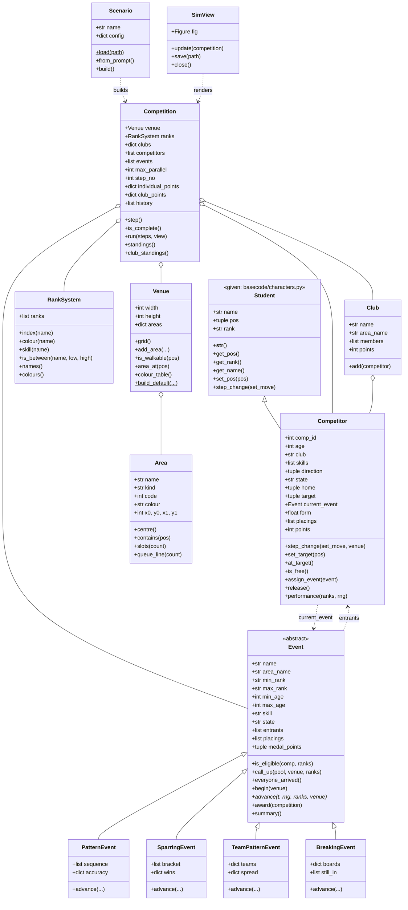

# Py Kwon Do - UML Class Diagram and Design Notes

Student Name : ajwang-kajwang
Student ID   : 6789998212

Design was done before coding (Sprint 0 of the sprint plan). This file
records the class model, the relationships, and the design decisions
that the code then implements.

## Class diagram



## Decisions recorded before coding

**Competitor is-a Student, not has-a.** A Competitor *is* the thing
that has a name, a position, a rank and a `step_change()`; the extra
attributes (id, age, club, skills, direction, state) are additions, not
a different kind of object. Subclassing keeps the given
`get_namelist()` / `get_ranklist()` helpers working unchanged, which
composition would have broken. The cost is that `Competitor` inherits
the given random-walk `step_change()` and must override it; that
override keeps the `set_move=` contract so group events can still drive
it the way PracTest3 Task 4 did.

**Competitor state machine.** Five states, and almost all of the later
logic reduces to "what do I do in this state":

```
waiting  --called up-->  travelling  --arrived-->  ready
   ^                                                 |
   |                                            event starts
returning  <--event finished--  competing  <---------+
   |
   +--arrived home--> waiting
```

**Ranks are an ordered list**, extending the given
`rank_defs = ["White", "Yellow", "Green", "Blue", "Black"]`. Eligibility
is then an index comparison, and adding a belt colour is one line in one
place (the scenario file), not a change to any event.

**Events: one base class, four subclasses.** Everything shared - who is
eligible, calling entrants up, waiting for arrivals, awarding medal
points - lives in `Event`. What differs is only *how a round is run and
scored*, which is the single method each subclass overrides
(`advance()`). Four types:

| Type | Individual/group | Scored on | Rank band |
|---|---|---|---|
| `PatternEvent` | individual | accuracy over a fixed move sequence | any band |
| `SparringEvent` | individual, paired | single-elimination bouts, similar ranks paired | mid to high |
| `TeamPatternEvent` | group (by club) | team mean accuracy minus synchronisation spread | any band |
| `BreakingEvent` | individual | boards broken, escalating until failure | high only |

**The overlapping-eligibility rule.** A Competitor can only be in one
Event at a time (`current_event`). The Competition will not call an
Event up until *every* competitor eligible for it is free. Two events
therefore run in parallel only when their eligible pools are disjoint
(different rank bands or different skills) - which is exactly how a real
competition uses two mats. Without this rule a competitor eligible for
two overlapping events gets pulled off the first mat and *neither* event
ever sees all entrants arrive, so both silently produce empty results.

**Venue is a coded grid.** One integer per cell: 0 = wall, 1 = floor,
then one code per club area and one per event mat, exactly like
PracTest3 Task 2's `10`-border / `5`-centre floor, but with a colour
table so each area draws in its own colour with a legend. Every area's
coordinates live in one `Area` object, so the events and the movement
code ask the Venue where a mat is instead of hard-coding it.

**Orientation.** `imshow` draws row 0 at the top, so y increases
*downward*. Positions are `(x, y)` and the grid is indexed `[y, x]`,
following PracTest3. Club areas are along the bottom of the array, which
is the bottom of the picture.
